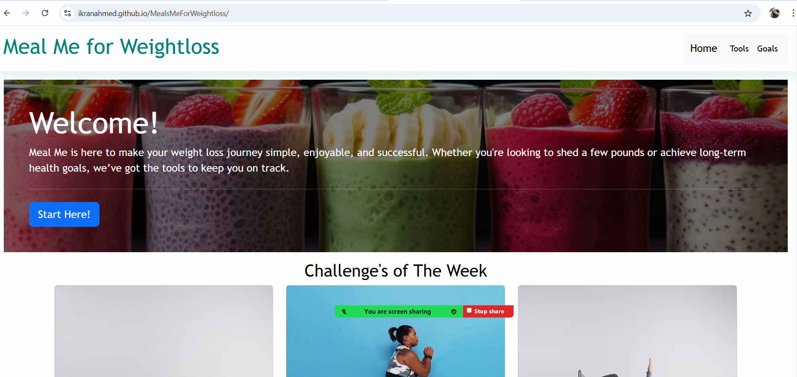

# <Meal Me for Weightloss>

## Description
Meal Me for Weightloss was created to give optional meal replacements or substitutes to help weightloss and maintain healthy eating habits.

- Created a unique website that can personalize weightloss goals
- This website was generated to be a one stop shop for exercise ideas, healthy food choices, and place to track weightloss goals.
- Gives the user multiple resouces for weightloss like, water intake, calorie burner, meal replacemenrs, and fun exercise challenges every week.
- What did you learn? I've learned to different techniques from bootstrap to style my CSS.

## Table Of Contents

- [Home Page](#installation)
- [Tools](#usage)
- [Goals](#usage)

## Technologies
- Bootstrap
- HTML 
- CSS
- JavaScript

## Screenshot 
 

## Credits

List your collaborators, if any, with links to their GitHub profiles.

If you used any third-party assets that require attribution, list the creators with links to their primary web presence in this section.

## Live Link
 place deployed link here
 [Meal Me For Weightloss](https://ikranahmed.github.io/MealsMeForWeightloss/)

## Features

If your project has a lot of features, list them here.
 - Calorie Counter
 - BMI Calculator
 - Water Intake Calculator
 - Exercise Calculator
 - Challenge of the Week

## How to Contribute
- Fork Repo
